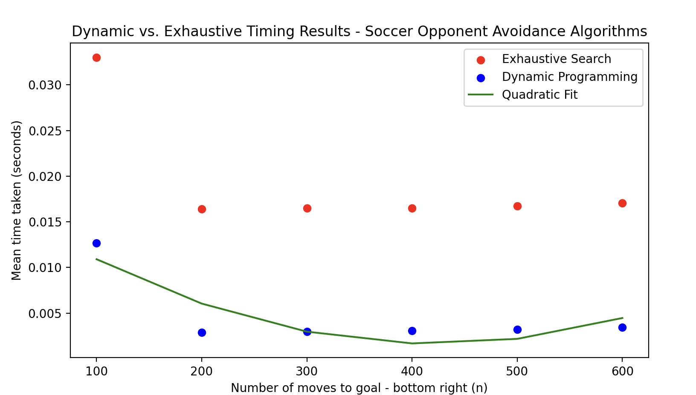

# Soccer Opponent Avoidance Algorithm

This repository contains a C++ implementation of an algorithm for soccer
 player opponent avoidance. The algorithm uses dynamic programming to
find the optimal trajectory for a player to avoid opponents and reach a
target location. The implementation includes two versions of the
algorithm: an exhaustive search `exhaustive3.cpp` and a dynamic programming approach `dynamic3.cpp`.

## About Algorithm

The soccer opponent avoidance problem is a well-known problem in
robotics and artificial intelligence, which involves designing an
algorithm or strategy for a robot or agent to avoid opponents while
moving towards a target destination, such as the opponent's goal in
soccer.

### Project Report and Empirical Analysis Documentation:

[https://docs.google.com/document/d/e/2PACX-1vT7K3nddQpt7jogK_Qn0aygSog5GzpDzhDuzUmgJ27EufchBTKqyGQhoLFGnC-Bvkht_Gl448feYsIF/pub]()



## Requirements

To run the program, you will need a C++ compiler that supports C++11 standard. The recommended compiler is `clang++`.

## Files

* `exhaustive3.cpp`: implementation of the exhaustive search algorithm
* `dynamic3.cpp`: implementation of the dynamic programming algorithm
* `empirical_analysis.py`: Python script for running experiments and generating plots for the empirical analysis of the algorithms

## Run the Code

To run the exhaustive search algorithm, execute the following command:

```
clang++ -std=c++11 exhaustive3.cpp -o exhaustive3.out
```

```
./exhaustive3.out
```

To run the dynamic programming algorithm, execute the following command:

```
clang++ -std=c++11 dynamic3.cpp -o dynamic3.out
```

```
./dynamic3.out
```

## Results

The empirical analysis shows that the dynamic programming algorithm performs significantly better than the exhaustive search algorithm in terms of runtime and memory usage, especially for larger instances. The results are presented in the `plots` folder.

## Acknowledgments

This implementation is based on the algorithm described in the paper "An Algorithm for Soccer Player Opponent Avoidance" by Burchan Bayazit and Jean-Claude Latombe, published in the Proceedings of the IEEE International Conference on Robotics and Automation (ICRA), 1999.

## Authors

* Abel Mendoza

## License

This project is licensed under the MIT License - see the [LICENSE](https://chat.openai.com/c/LICENSE) file for details.
